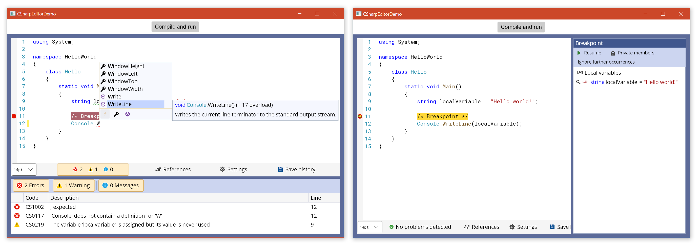

# CSharpEditor: A C# source code editor with syntax highlighting, intelligent code completion and real-time compilation error checking


## Introduction

**CSharpEditor** is a C# source code editor control for [Avalonia](https://github.com/AvaloniaUI/Avalonia) applications.

This library provides a control that can be added to Avalonia windows and integrates:

* The main code editor with search/replace functions and intellisense-like code completion.

* A panel showing errors in the code.

* A panel to add/remove assembly references.

* A panel showing the save history of the file (that can persist across different sessions, if the application implements it properly).

* A panel with general settings.

The code entered in this control can also be "debugged": by entering a comment `/* Breakpoint */` before a statement in the code, execution of the code will pause at that point, and the editor will enter a debugger-like state in which the code is read-only and the value of local variables is shown in a panel on the right. A breakpoint can also be entered by clicking next to the line number where the breakpoint is to be inserted; if it is allowed in that position, the breakpoint comment will be inserted automatically.

CSharpEditor is a .NET Standard 2.0 library, and should be usable in .NET Framework 4.7.2+, .NET Core 2.0+, and .NET 5.0+ projects (and probably on Mono and other platforms). It is released under a GPLv3 licence. You can find the full documentation for this library at the [documentation website](https://arklumpus.github.io/CSharpEditor). A [PDF reference manual](https://arklumpus.github.io/CSharpEditor/CSharpEditor.pdf) is also available.

<p align="center">

</p>

## Getting started

First of all, you need to install the [NuGet package](https://www.nuget.org/packages/CSharpEditor/) in your project.

The editor control cannot be added directly to the Window in XAML code, because it requires some non-trivial initialisation; you can create a new `Editor` control using the static method `Editor.Create` and then add it to the window:

```CSharp
using CSharpEditor;

// ...
    Editor editor = await Editor.Create();

    Grid grid = this.FindControl<Grid>("EditorContainer");
    grid.Children.Add(editor);
```

The first time an `Editor` control is added to your window may take some time to initialise; subsequent `Editor` controls will be created much faster.

The `Editor.Create` static method has multiple parameters, all of which are optional:

* `string initialText`: this is simply the initial source code that is shown in the control when it is created.

* `string preSource`: the code provided in this parameter is not shown to the user in the editor, but it is prepended to the code in the editor when compiling and checking for errors. This makes it possible e.g. to allow the user to edit just a single method, without having to show boilerplate class and namespace definitions in the editor.

* `string postSource`: same as `preSource`, but this code is included _after_ the code the user has entered in the control.

* `IEnumerable<CachedMetadataReference> references`: this parameter determines the assembly references that are used to compile the code (the user can add or remove references using the panel in the interface). If this is not provided, the control will automatically build a list of references based on the assemblies that are loaded in the current `AppDomain`.

* `CSharpCompilation compilationOptions`: these are the `CompilationOptions` used to compile the code. If this is not provided, the control will use default compilation options with a `DynamicallyLinkedLibrary` output target.

* `string guid`: this parameter provides an identifier for the control. This will be used, in particular, to store the save history of the file. If the control is initialised with the same `guid` across different sessions, the save history of the file will be restored.

* `Shortcut[] additionalShortcuts`: this makes it possible to display additional application-specific shortcuts in the shortcut section of the settings panel. Note that this does not actually implement the shortcut behaviour (which needs to be implemented separately by the developer) - it is simply provided so that users can open the settings panel and see all the shortcuts that can be used with the editor in the same place.

Take a look at the [`MainWindow.xaml.cs` file](https://github.com/arklumpus/CSharpEditor/blob/master/CSharpEditorDemo/MainWindow.axaml.cs) in the CSharpEditorDemo project to see how this works in practice.

## Compiling and breakpoints

If you wish, you can use the classes and methods in the `Microsoft.CodeAnalysis.CSharp` namespace to compile the source code entered by the user. However, the `Editor` control also provides a `Compile` method that does it for you, returning an awaitable `Task` that returns a tuple of an `Assembly` and a `CSharpCompilation`. If the compilation attempt was successful, the `Assembly` will contain the compiled assembly and the `CSharpCompilation` should hold no error messages; if the compilation was not successful, the `Assembly` will be `null` and the `CSharpCompilation` can be used to retrieve the compilation error messages.

The `Compile` method has two optional arguments: 

* `Func<BreakpointInfo, bool> synchronousBreak`

* `Func<BreakpointInfo, Task<bool>> asynchronousBreak`

If these are provided, at any point in the code where the comment `/* Breakpoint */` is found the code will be altered to call the function that has been provided. The function will be called with a `BreakpointInfo` argument that contains information about the name and value of local variables that have been captured at the breakpoint.

The `synchronousBreak` function is called for breakpoints that happen within synchronous code; the `asynchronousBreak` function will be called for breakpoints that happen within asynchronous code. The functions should return a boolean value, indicating whether the breakpoint should be hit again if the code is executed again (think e.g. a breakpoint within a `for` or `while` loop).

If you wish to enable the default UI for breakpoints, you can just pass the `SynchronousBreak` and `AsynchronousBreak` instance methods of the `Editor` as arguments to the `Compile` method.

There is a catch, however: if synchronous code is running in the UI thread, it is not possible to handle breakpoints using the default UI, as this would cause a deadlock because the UI thread is paused waiting for the user to resume it _through the UI_, which is not possible. To prevent this, the default `SynchronousBreak` handler checks whether it has been invoked from the UI thread and, if so, does not actually enter the breakpoint.

## Debugging using a separate process

A way to address the issue of synchronous breakpoints in the UI thread is to use a separate process to display the breakpoint UI. This can be achieved using the `InterprocessDebuggerServer` and `InterprocessDebuggerClient` classes.

To use this approach, you need to create two separate processes, one for the client and one for the server.

The server process contains the main UI of the application, e.g. the `Editor` control and any associated paraphernalia. Within this project, you should create an `InterprocessDebuggerServer` object, providing it with the path to the executable of the client process. Then, when you invoke the `Compile` method to compile the code in the `Editor`, instead of invoking it with the `SynchronousBreak` and `AsynchronousBreak` methods of the `Editor`, you provide the same methods from the `InterprocessDebuggerServer` object. For example

```CSharp
using CSharpEditor;

// ...

    InterprocessDebuggerServer server = new InterprocessDebuggerServer(@"path/to/client.exe");
    Editor editor = await Editor.Create();

    // ...
    
    // Instead of...
    Assembly assembly = (await editor.Compile(editor.SynchronousBreak, editor.AsynchronousBreak)).Assembly;

    // Use this:
    Assembly assembly = (await editor.Compile(server.SynchronousBreak(editor), server.AsynchronousBreak(editor))).Assembly;
```

The client process consists of just a single window, containing an `InterprocessDebuggerClient` control that has been created by supplying it with the command-line argument with which the process has been invoked.

When the server process executes the compiled code and hits a breakpoint, the client process is notified; the server process then waits for a signal from the client process to resume the execution of the code. If the default UI is being used, this is all handled rather transparently by the `InterprocessDebuggerServer` and `InterprocessDebuggerClient` classes.

Take a look at the [CSharpEditorIPCDemoServer](https://github.com/arklumpus/CSharpEditor/blob/master/CSharpEditorIPCDemoServer) and [CSharpEditorIPCDemoClient](https://github.com/arklumpus/CSharpEditor/blob/master/CSharpEditorIPCDemoClient) projects for an example of this approach.